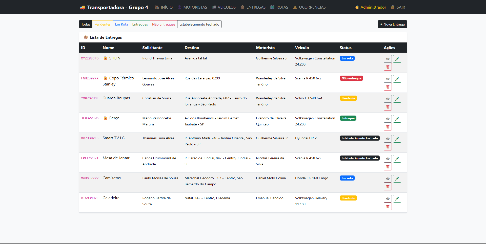
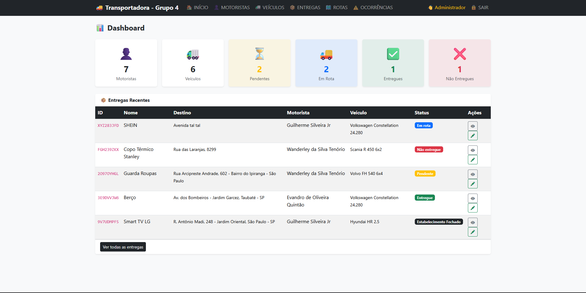
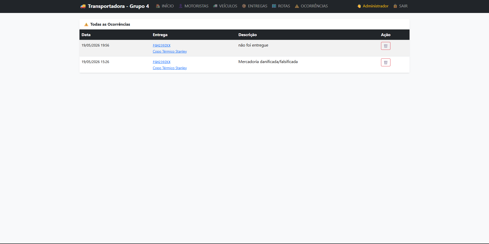
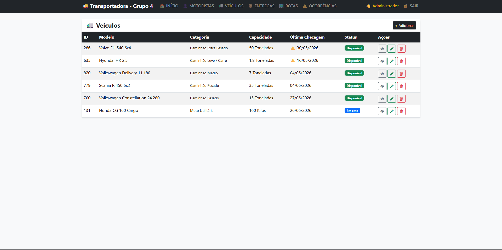

# 🚚 Sistema de Gestão Transportadora e Logística

Sistema CRUD desenvolvido em PHP e MySQL para gerenciamento de entregas, motoristas, veículos e rotas.

## Tecnologias

- PHP
- MySQL
- HTML5
- CSS3
- JavaScript
- Bootstrap
- Git/GitHub

## Funcionalidades

- Login administrativo
- Cadastro de entregas
- Gestão de motoristas
- Controle de veículos
- Registro de ocorrências
- Atualização de status

## Preview










## Banco de Dados

O banco pode ser recriado utilizando:

```bash
database/schema.sql
```

## Como executar

1. Clone o repositório
2. Importe o schema.sql no MySQL
3. Configure conexao.php
4. Execute no XAMPP

```bash
http://localhost/transportadora-logistica-crud
```

## UML

Diagramas disponíveis na pasta:

```text
/docs
```
